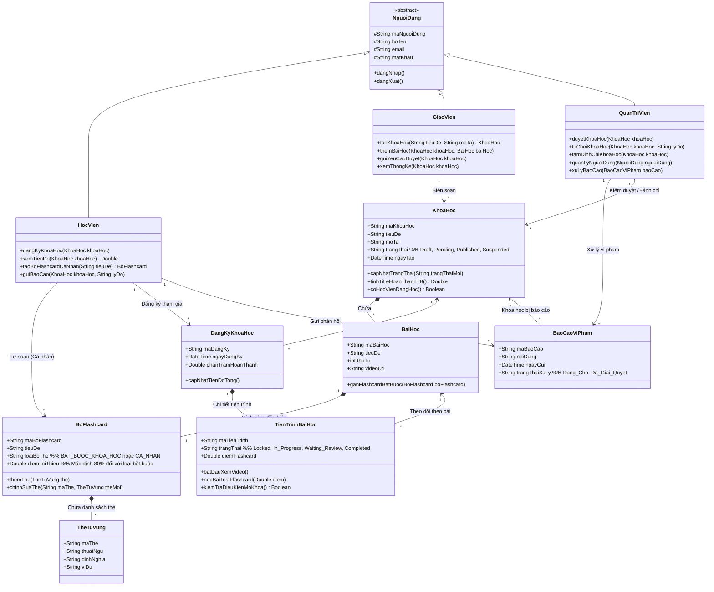

```mermaid
classDiagram
    %% Lớp cơ sở Người dùng
    class NguoiDung {
        <<abstract>>
        #String maNguoiDung
        #String hoTen
        #String email
        #String matKhau
        +dangNhap()
        +dangXuat()
    }

    class HocVien {
        +dangKyKhoaHoc(KhoaHoc khoaHoc)
        +xemTienDo(KhoaHoc khoaHoc) Double
        +taoBoFlashcardCaNhan(String tieuDe) BoFlashcard
        +guiBaoCao(KhoaHoc khoaHoc, String lyDo)
    }

    class GiaoVien {
        +taoKhoaHoc(String tieuDe, String moTa) KhoaHoc
        +themBaiHoc(KhoaHoc khoaHoc, BaiHoc baiHoc)
        +guiYeuCauDuyet(KhoaHoc khoaHoc)
        +xemThongKe(KhoaHoc khoaHoc)
    }

    class QuanTriVien {
        +duyetKhoaHoc(KhoaHoc khoaHoc)
        +tuChoiKhoaHoc(KhoaHoc khoaHoc, String lyDo)
        +tamDinhChiKhoaHoc(KhoaHoc khoaHoc)
        +quanLyNguoiDung(NguoiDung nguoiDung)
        +xuLyBaoCao(BaoCaoViPham baoCao)
    }

    %% Nhóm Quản lý Khóa học và Nội dung
    class KhoaHoc {
        +String maKhoaHoc
        +String tieuDe
        +String moTa
        +String trangThai  %% Draft, Pending, Published, Suspended
        +DateTime ngayTao
        +capNhatTrangThai(String trangThaiMoi)
        +tinhTiLeHoanThanhTB() Double
        +coHocVienDangHoc() Boolean
    }

    class BaiHoc {
        +String maBaiHoc
        +String tieuDe
        +int thuTu
        +String videoUrl
        +ganFlashcardBatBuoc(BoFlashcard boFlashcard)
    }

    %% Nhóm Quản lý Flashcard
    class BoFlashcard {
        +String maBoFlashcard
        +String tieuDe
        +String loaiBoThe  %% BAT_BUOC_KHOA_HOC hoặc CA_NHAN
        +Double diemToiThieu  %% Mặc định 80% đối với loại bắt buộc
        +themThe(TheTuVung the)
        +chinhSuaThe(String maThe, TheTuVung theMoi)
    }

    class TheTuVung {
        +String maThe
        +String thuatNgu
        +String dinhNghia
        +String viDu
    }

    %% Nhóm Quản lý Tiến trình học tập
    class DangKyKhoaHoc {
        +String maDangKy
        +DateTime ngayDangKy
        +Double phanTramHoanThanh
        +capNhatTienDoTong()
    }

    class TienTrinhBaiHoc {
        +String maTienTrinh
        +String trangThai  %% Locked, In_Progress, Waiting_Review, Completed
        +Double diemFlashcard
        +batDauXemVideo()
        +nopBaiTestFlashcard(Double diem)
        +kiemTraDieuKienMoKhoa() Boolean
    }

    %% Nhóm Báo cáo / Phản hồi
    class BaoCaoViPham {
        +String maBaoCao
        +String noiDung
        +DateTime ngayGui
        +String trangThaiXuLy  %% Dang_Cho, Da_Giai_Quyet
    }

    %% QUAN HỆ KẾ THỪA (Inheritance)
    NguoiDung <|-- HocVien
    NguoiDung <|-- GiaoVien
    NguoiDung <|-- QuanTriVien

    %% QUAN HỆ NỘI DUNG KHÓA HỌC
    GiaoVien "1" --> "*" KhoaHoc : Biên soạn
    KhoaHoc "1" *-- "*" BaiHoc : Chứa
    BaiHoc "1" *-- "1" BoFlashcard : Đính kèm điều kiện
    BoFlashcard "1" *-- "*" TheTuVung : Chứa danh sách thẻ
    HocVien "1" --> "*" BoFlashcard : Tự soạn (Cá nhân)

    %% QUAN HỆ TIẾN TRÌNH & ĐĂNG KÝ
    HocVien "1" --> "*" DangKyKhoaHoc : Đăng ký tham gia
    KhoaHoc "1" <-- "*" DangKyKhoaHoc : Thuộc về
    DangKyKhoaHoc "1" *-- "*" TienTrinhBaiHoc : Chi tiết tiến trình
    BaiHoc "1" <-- "*" TienTrinhBaiHoc : Theo dõi theo bài

    %% QUAN HỆ QUẢN TRỊ & PHẢN HỒI
    HocVien "1" --> "*" BaoCaoViPham : Gửi phản hồi
    KhoaHoc "1" <-- "*" BaoCaoViPham : Khóa học bị báo cáo
    QuanTriVien "1" --> "*" BaoCaoViPham : Xử lý vi phạm
    QuanTriVien "1" --> "*" KhoaHoc : Kiểm duyệt / Đình chỉ
```
